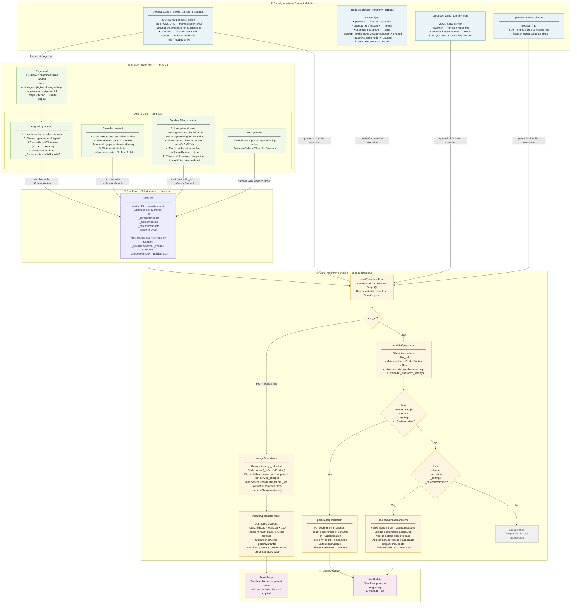

```mermaid
flowchart TD
    %% ── SHOPIFY ADMIN ──────────────────────────────────────────────
    subgraph ADMIN["🗄️  Shopify Admin — Product Metafields"]
        MF1["product.custom_emojis_transform_settings\n────────────────────────────────\nJSON array per emoji option\n• icon  (CDN URL — theme display only)\n• utfChar  (theme uses for substitution)\n• cartChar  ← function reads this\n• price  ← function reads this\n• title  (logging only)"]
        MF2["product.calendar_transform_settings\n────────────────────────────────\nJSON object\n• gemMap  ← function reads this\n• quantityTiers[].quantity  ← reads\n• quantityTiers[].price  ← reads\n• quantityTiers[].serviceChargeVariantId  ✗ unused\n• quantitySelectorTitle  ✗ unused\n⚠️ Zero prod products use this"]
        MF3["product.charms_quantity_tiers\n────────────────────────────────\nJSON array per tier\n• quantity  ← function reads this\n• serviceChargeVariantId  ← reads\n• maxQuantity  ✗ unused by function"]
        MF4["product.service_charge\n────────────────────────────────\nBoolean flag\n'true' = this is a service charge line\n← function reads .value as string"]
    end

    %% ── SHOPIFY STOREFRONT ─────────────────────────────────────────
    subgraph STOREFRONT["🌐  Shopify Storefront — Theme JS"]
        direction TB
        S1["Page load\nSDG.Data.customIconsJson loaded\nfrom custom_emojis_transform_settings\n→ powers emoji picker UI\n→ maps utfChar → icon for display"]

        subgraph ATC["Add to Cart — theme.js"]
            ATC1["Engraving product\n────────────────────────────\n1. User types text + selects emojis\n2. Theme replaces each typed\n   utfChar with cartChar token\n   (e.g. ♥ → #Heart#)\n3. Writes cart attribute:\n   _Customization = 'A#Heart#B'"]
            ATC2["Calendar product\n────────────────────────────\n1. User selects gem per calendar day\n2. Theme reads data-variant-title\n   from each .js-product-calendar-day\n3. Writes cart attribute:\n   _calendarVariants = '1: Jan, 2: Feb'"]
            ATC3["Bundle / Charm product\n────────────────────────────\n1. User picks charms\n2. Theme generates shared ref ID:\n   Date.now().toString(36) + random\n3. Writes on ALL lines in bundle:\n   _ref = 'm3x1f2abc'\n4. Marks the base/parent line:\n   _isParentProduct = 'true'\n5. Theme adds service charge line\n   to cart if tier threshold met"]
            ATC4["MTO product\n────────────────────────────\nLiquid hidden input or buy-the-look.js\nwrites:\n  Made to Order = 'Ships 8-10 weeks'"]
        end
    end

    %% ── CART ───────────────────────────────────────────────────────
    subgraph CART["🛒  Cart Line — What travels to checkout"]
        LINE["Cart Line\n────────────────────────\nVariant ID + quantity + cost\nAttributes set by theme:\n  _ref\n  _isParentProduct\n  _Customization\n  _calendarVariants\n  Made to Order\n\n(Also present but NOT read by function:\n _Multiple Charms, _Product Calendar,\n _componentIndex, _builder, etc.)"]
    end

    %% ── FUNCTION ───────────────────────────────────────────────────
    subgraph FUNC["⚙️  Cart Transform Function — runs at checkout"]
        direction TB
        F0["cartTransformRun\nReceives all cart lines via GraphQL\nReads metafields live from Shopify graph"]

        F1{"Has _ref?"}

        F2["updateOperations\n────────────────────────\nFilters lines where:\n• No _ref\n• Merchandise is ProductVariant\n• Has custom_emojis_transform_settings\n  OR calendar_transform_settings"]

        F3["mergeOperations\n────────────────────────\nGroups lines by _ref value\nFinds parent (_isParentProduct)\nFinds children (same _ref, not parent,\n  not service_charge)\nFinds service charge line (same _ref +\n  variant ID matches tier's\n  serviceChargeVariantId)"]

        F4{"Has\ncustom_emojis\n_transform\n_settings\n+ _Customization?"}

        F5{"Has\ncalendar\n_transform\n_settings\n+ _calendarVariants?"}

        F6["parseEmojiTransform\n────────────────────────\nFor each emoji in settings:\n  count occurrences of cartChar\n  in _Customization\n  price += count × emoji.price\nOutput: lineUpdate\n  fixedPricePerUnit = new total"]

        F7["parseCalendarTransform\n────────────────────────\nParse months from _calendarVariants\nLookup each month in gemMap\nAdd gemstone prices to base\nAdd tier service charge if applicable\nOutput: lineUpdate\n  fixedPricePerUnit = new total"]

        F8["mergeOperations result\n────────────────────────\nComputes discount:\n  totalChildCost / totalCost × 100\nPasses through Made to Order attribute\nOutput: linesMerge\n  parentVariantId\n  cartLines (parent + children + svc)\n  percentageDecrease"]

        SKIP["No operation\n(line passes through unchanged)"]
    end

    %% ── OUTPUT ─────────────────────────────────────────────────────
    subgraph OUT["✅  Shopify Output"]
        O1["lineUpdate\nNew fixed price on engraving\nor calendar line"]
        O2["linesMerge\nBundle collapsed to parent variant\nwith percentage discount applied"]
    end

    %% ── EDGES ──────────────────────────────────────────────────────
    MF1 -->|"loaded at page load"| S1
    MF1 -->|"queried at function execution"| F0
    MF2 -->|"queried at function execution"| F0
    MF3 -->|"queried at function execution"| F0
    MF4 -->|"queried at function execution"| F0

    S1 --> ATC1
    ATC1 -->|"cart line with _Customization"| LINE
    ATC2 -->|"cart line with _calendarVariants"| LINE
    ATC3 -->|"cart lines with _ref + _isParentProduct"| LINE
    ATC4 -->|"cart line with Made to Order"| LINE

    LINE --> F0
    F0 --> F1
    F1 -->|"Yes — bundle line"| F3
    F1 -->|"No"| F2
    F2 --> F4
    F4 -->|"Yes"| F6
    F4 -->|"No"| F5
    F5 -->|"Yes"| F7
    F5 -->|"No"| SKIP
    F3 --> F8
    F6 --> O1
    F7 --> O1
    F8 --> O2

    %% ── STYLES ─────────────────────────────────────────────────────
    classDef metafield fill:#e8f4f8,stroke:#4a90b8,color:#1a1a1a
    classDef theme fill:#f0f8e8,stroke:#6aaa3a,color:#1a1a1a
    classDef func fill:#fdf5e0,stroke:#d4a017,color:#1a1a1a
    classDef output fill:#f8e8f0,stroke:#b84a8a,color:#1a1a1a
    classDef skip fill:#f0f0f0,stroke:#aaa,color:#555

    class MF1,MF2,MF3,MF4 metafield
    class ATC1,ATC2,ATC3,ATC4,S1 theme
    class F0,F1,F2,F3,F4,F5,F6,F7,F8 func
    class O1,O2 output
    class SKIP skip

```